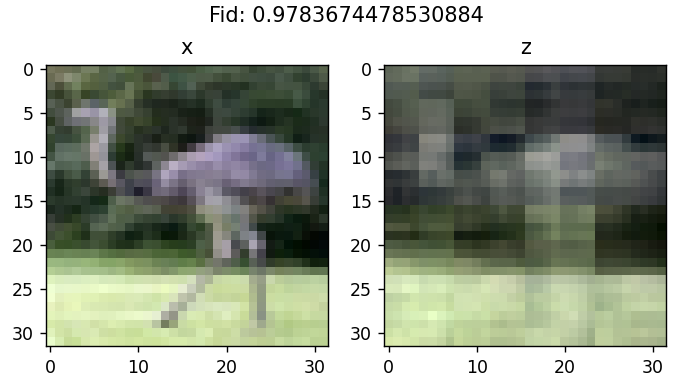

```
[QAM256]
10000011 10000001 10001001 10001011 10101011 10101001 10100001 10100011 | 00100011 00100001 00101001 00101011 00001011 00001001 00000001 00000011
10000010 10000000 10001000 10001010 10101010 10101000 10100000 10100010 | 00100010 00100000 00101000 00101010 00001010 00001000 00000000 00000010
10000110 10000100 10001100 10001110 10101110 10101100 10100100 10100110 | 00100110 00100100 00101100 00101110 00001110 00001100 00000100 00000110
10000111 10000101 10001101 10001111 10101111 10101101 10100101 10100111 | 00100111 00100101 00101101 00101111 00001111 00001101 00000101 00000111
10010111 10010101 10011101 10011111 10111111 10111101 10110101 10110111 | 00110111 00110101 00111101 00111111 00011111 00011101 00010101 00010111
10010110 10010100 10011100 10011110 10111110 10111100 10110100 10110110 | 00110110 00110100 00111100 00111110 00011110 00011100 00010100 00010110
10010010 10010000 10011000 10011010 10111010 10111000 10110000 10110010 | 00110010 00110000 00111000 00111010 00011010 00011000 00010000 00010010
10010011 10010001 10011001 10011011 10111011 10111001 10110001 10110011 | 00110011 00110001 00111001 00111011 00011011 00011001 00010001 00010011
------------------------------------------------------------------------+------------------------------------------------------------------------
11010011 11010001 11011001 11011011 11111011 11111001 11110001 11110011 | 01110011 01110001 01111001 01111011 01011011 01011001 01010001 01010011
11010010 11010000 11011000 11011010 11111010 11111000 11110000 11110010 | 01110010 01110000 01111000 01111010 01011010 01011000 01010000 01010010
11010110 11010100 11011100 11011110 11111110 11111100 11110100 11110110 | 01110110 01110100 01111100 01111110 01011110 01011100 01010100 01010110
11010111 11010101 11011101 11011111 11111111 11111101 11110101 11110111 | 01110111 01110101 01111101 01111111 01011111 01011101 01010101 01010111
11000111 11000101 11001101 11001111 11101111 11101101 11100101 11100111 | 01100111 01100101 01101101 01101111 01001111 01001101 01000101 01000111
11000110 11000100 11001100 11001110 11101110 11101100 11100100 11100110 | 01100110 01100100 01101100 01101110 01001110 01001100 01000100 01000110
11000010 11000000 11001000 11001010 11101010 11101000 11100000 11100010 | 01100010 01100000 01101000 01101010 01001010 01001000 01000000 01000010
11000011 11000001 11001001 11001011 11101011 11101001 11100001 11100011 | 01100011 01100001 01101001 01101011 01001011 01001001 01000001 01000011
```

Assume an 8x8 RGB image is embeded in a quantunm circuit with AmpEnc in layout:
```
| B | R |
| 0 | G |
```

To simulate a classical CNN, we'd firstly find a way to convolve over all `2x2` blocks (aggregating from locality!). There are $3*8*8/(2*2) = 48$ valid sub-blocks, hence in analogue we'll need $48$ `mult-controlled U3` gates to extract the features. Note that in classical CNNs, the filter kernels (ie. learnable parameters) are shared across all sub-blocks. But in NISQ, this is kinda difficult to mimic... OK, we can also just try making them different. 

Now the second question, where to put and how to arrange the feature map? The classical manner is to allocate a new memory block and keep it shaped as a 3d-array. Again, NISQ simulator cannot mimic this due to complexity... Experimentally we use $4$ ancilla qubits to store the feature values, lest polluting the original information holding in `|enc>` :) The ancilla-qubit use order follows the image spatial structure: left-upper blocks uses teh 1st ancilla qubit, right-upper the 2nd, etc. So that the i-th aniclla qubit collects all data from the same region within the image. 

To conclude so far, we utilize this ansatz template for **psuedo-convolutional feature extraction**: 

```
 |enc>            B-ch              R-ch       G-ch
Spatial |x>---------------------------------
Spatial |x>---------------------------------
Spatial |x>--○-○-○-○-●-○-●-●-------○-○-○-○--
Spatial |x>--○-●-●-○-○-●-●-○-------○-●-●-○--
Spatial |x>--○-○-○-○-○-○-○-○--...--○-○-○-○--    ...
Spatial |x>--○-○-●-●-○-○-●-●-------●-●-○-○--
Channel |x>--○-○-○-○-○-○-○-○-------○-○-○-○--
Channel |x>--●-●-●-●-●-●-●-●-------○-○-○-○--
 |anc>       | | | | | | | |  ...  | | | |
Ancilla |0>--U-U-|-|-U-U-|-|-------U-U-|-|--  // ↖：collects info from left  upper  region of the image 
Ancilla |0>------U-U-----U-U-----------U-U--  // ↗：collects info from right upper  region of the image 
Ancilla |0>---------------------------------  // ↙：collects info from left  bottom region of the image 
Ancilla |0>---------------------------------  // ↘：collects info from right bottom region of the image 
```

Actually, it's just a $PREP-SEL$ structure that reads from an `AmpEnc` register, then writes to an `AngleEnc` register, ie. the `AmpEnc->AngleEnc` converter. 😮 

Then we need a **learnable feature transformation**, just wrap a Hardware Efficient Ansatz around `|anc>` should look fine. 

```
                | | | |       (pairwise)
Ancilla |0>-U3--U-|-|-|-------U3-CU3--
Ancilla |0>-U3----U-|-|--...--U3-CU3--
Ancilla |0>-U3------U-|--...--U3-CU3--
Ancilla |0>-U3--------U-------U3-CU3--
```

Another key concept in classical CNN is **pooling**, a hardcoded non-learnable function force reducing the feature map size. That suggests us to do the same thing in `|anc>` register... uhm... but if so, we'll need anthor `|anc2>` to store the new results, wtf??! 

No! You'd no need pooling layers!! 
Since that "the i-th ancilla qubit collects all data from the same region grid within the image", this is by nature a "sum" pooler!  
We just need the rot-param divided by `n_feat_maps` to turn it into an "avg" pooler, keeping the power equivalent! 🎉  

Now it's time to chain up several convolutional layers to form a feedfoward network. This word "feedfoward" means that output feature maps from the 1st layer is fed into the input of the 2nd layer.  This is also impossible in our case -- neither `|anc>` or `|enc>` is proper for this operation. ┑(￣Д ￣)┍  

Have a try of this! Like above, each `mctr-U3` group extract features from a different resolution stage (from fine to coarse):

```
|enc>            B/R/G-ch
  Sp  |x>---------------------------------------------------------
  Sp  |x>---------------------------------------------------------
  Sp  |x>---------[○/●]-------------------------------------------
  Sp  |x>---------[○/●]-------------------------------------------
  Sp  |x>---------[○/●]---------------[○/●]-----------------------
  Sp  |x>---------[○/●]---------------[○/●]-----------------------
  Ch  |x>---------[○/●]---------------[○/●]---------------[○/●]---
  Ch  |x>---------[○/●]---------------[○/●]---------------[○/●]---
                    |                   |                   |
|anc> |0>-[U3]--[mctr-U3]-[U3-CU3]--[mctr-U3]-[U3-CU3]--[mctr-U3]---[CU3-U3]-->[Measure(Z)]
      |0>----------------------------------------------------[U3]/    // add a new wire to meet num-class
Notes:          U3(θ_i/48)          U3(θ_i/12)          U3(θ_i/3)
               (48 mctrls)         (12 mctrls)         (3 mctrls)
                2x2 block           4x4 block           8x8 block
```

This total gate_cnt  is $(48+12+3)   + 4*8 = 95$ for `n_layer=1` of this ansatz.
This total param_cnt is $(48+12+3)/3 + 4*8 = 53$ for `n_layer=1` of this ansatz.

**TODO**: Can we theoretically proove if this is a kind of ResNet, Feature-Pyramid or just Data-ReUpload in math? 🤔

Finall for the measure part, you just need enough tuning and experiments...


<div STYLE="page-break-after: always;"></div>


⚪ Extending to the real CIFAR10 problem

We have a $12$ qubits `|enc>` storing in 4096-QAM. The sub-block counts:

- `2x2`: 768
- `4x4`: 192
- `8x8`: 48
- `16x16`: 12
- `32x32`: 3

And still allocate only $4$ qubits as `|anc>`, to satisfy the implicit "avg" pooler.
